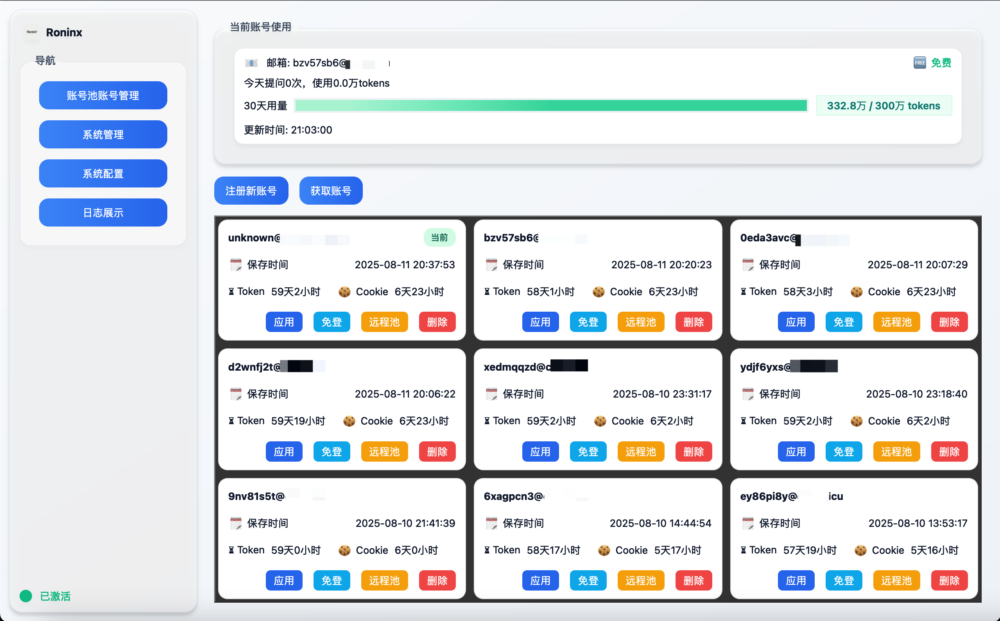
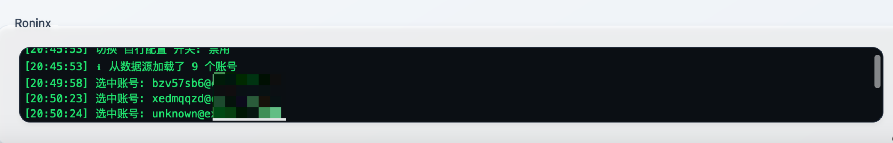

## RoninX · Cursor 账号管理与免登助手

一站式管理 Cursor 账号，免登录直达官网/控制台，查询用量与套餐；支持一键注册入池、重置机器 ID、重启 Cursor 等高频操作，开箱即用、效率至上。

---

## 为什么选择 RoninX
- 省时省力：一键获取可用账号、应用到本机 Cursor，无需手动粘贴 Token/Cookie。
- 可视化高：卡片化展示账号状态、Token/Cookie 剩余与 30 天用量进度条，一目了然。
- 开箱即用：内置 TempMail Plus 支持，也可切换为自定义邮箱配置。
- 风险可控：激活校验与审计日志，关键动作有迹可循，降低误用风险。
- 实战便捷：重置机器 ID、重启 Cursor、免登打开网页等常用实操一步到位。

---

## 主要功能
- 账号池管理：注册入池、获取未分配账号、应用到本机、免登打开网页、添加到远程池。
- 使用信息查询：
  - 今日事件数与 token 用量文本汇总。
  - 套餐类型 free/pro 自动显示。
  - 「近 30 天 token 总量」进度条。
- 系统工具：重置机器 ID、重启 Cursor。
- 系统配置：
  - 是否启用自定义 TempMail Plus。
  - Register 配置项（邮箱后缀、固定邮箱、验证码来源、是否使用 TempMail 作为注册邮箱）。

---

## 预览截图
> 以下为仓库内图片示例，实际界面以运行时为准。

- 功能总览

- 操作体验

- 关注免费激活二维码

---

## 环境要求
- 系统：macOS / Windows / Linux(还没有考虑做)
- Python：3.10+（建议）

---

## 工具地址
- 夸克网盘：`https://pan.quark.cn/s/cb303b648044`
- 验证码: `wnNN`

## 许可证与作者
- 作者：RoninX（欢迎 Star / Issue 反馈）

如果这个工具对你有帮助，欢迎分享给同事与朋友，一起提升效率！
