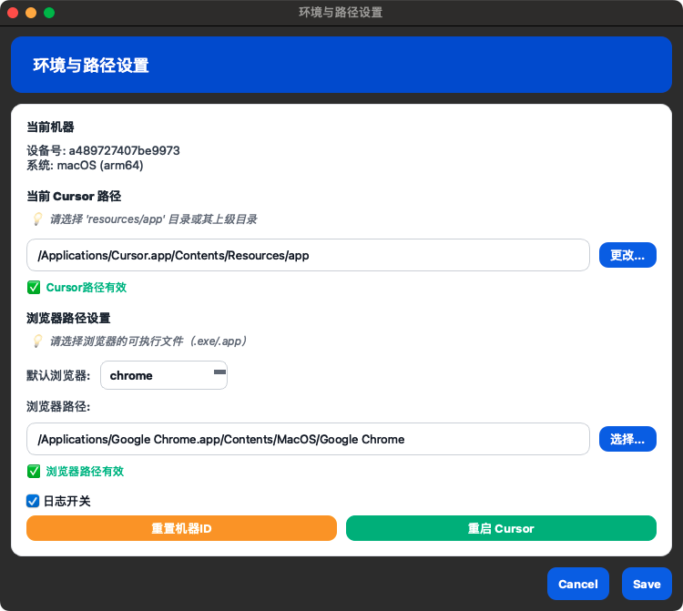

# 🚀 Cursor 免费“续杯”指南｜写到爽为止

> 不再等额度重置！这套超轻量工具，帮你稳定“免费续杯”，随时开写、丝滑不断电。

---

## 🔥 它能做什么（亮点一图读懂）

| 能力 | 体验 | 说明 |
|---|---|---|
| ♻️ 免费续杯 | 一键获取新号 | 多后缀轮询 |
| 🔐 免密登录 | 一键进官网 | C避免重复登录 |
| 📊 额度可视化 | 一眼看懂 | 首页显示「近30天 tokens」，支持单个/批量刷新 |
| 🧰 账号池管理 | 稳 | 集中保存/分配账号与 Token，支持远程/本地 |
| 📝 日志友好 | 好排查 | 中文日志、失败原因提示，遇事不慌 |

---

## ✅ 三步上手（0成本）

1. 打开工具 → 首页自动拉取「近30天 tokens」
2. 点击「进入官网」 → 免密登录（Cookie 池复用登录态）
3. 需要时 → 点「手动批量刷新」或对单个账号「查询/刷新 Tokens」

> 提示：程序启动会自动批量获取 tokens，确保开箱即用；也可随时手动刷新。

---


---

## 🛠️ 工作方式（更稳的实现）

- 多后缀邮箱轮询注册 → 获取新号与长效 Token  
- Cookie 池 → 免密直达官网  
- 账号池（本地/远端） → 集中保存 + 分配  
- 「近30天 tokens」 → 启动自动拉取，可单/批量刷新  

> 失败了也不慌：中文日志告诉你“哪里不对”，便于快速定位。

---

## 🖼️ 界面一览（替换为你的截图）





---

## 🧭 快速安装（可选命令行部署）

```bash
1、打开云盘链接：https://pan.quark.cn/s/cfbb5ce9398a
2、双击打开，是不是很方便？
ps：目前支持mac全架构，win x86架构

```

---

## ❓FAQ

- Q：会影响我本机浏览器吗？  
  A：不会。只跟踪本次启动的进程，不会强杀全局进程。

- Q：额度为 0 能立刻“续杯”吗？  
  A：支持自动注册与免登切换，多域名后缀轮询，失败自动兜底。

- Q：我的数据安全吗？  
  A：账号与 Cookie 仅保存在本地或受控服务端，可导入/导出，不做破坏性操作。

---

## 📎 合规与声明
- 工具仅用于学习与效率提升，请遵守目标平台条款与当地法律法规

---

## 👉 行动召唤
现在就「续杯」，把卡住的项目继续推完！  
如需安装包与图文手册，回复关键词【续杯】获取。
